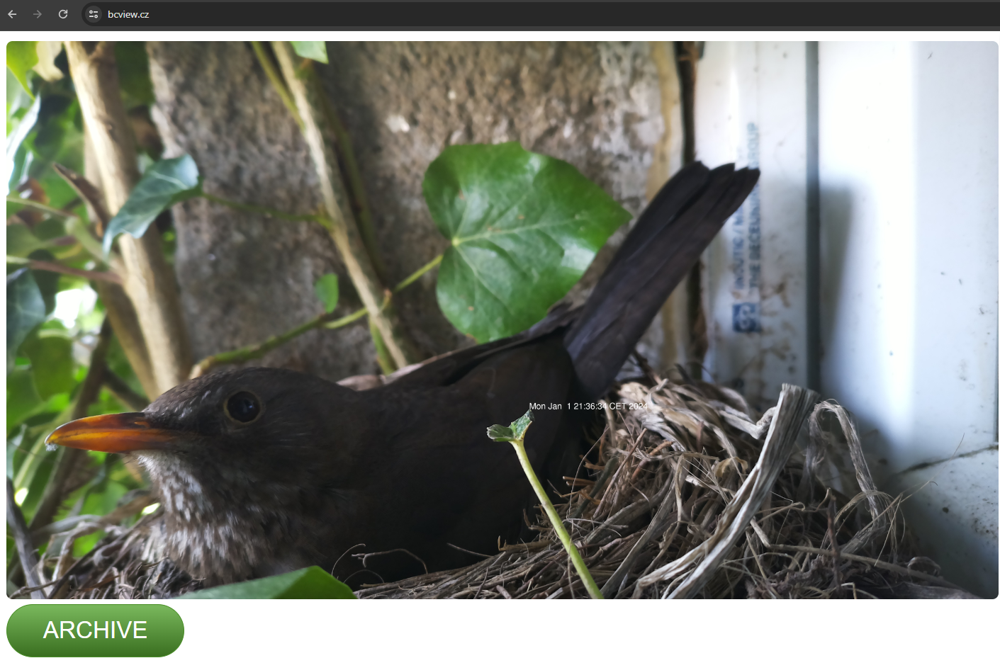
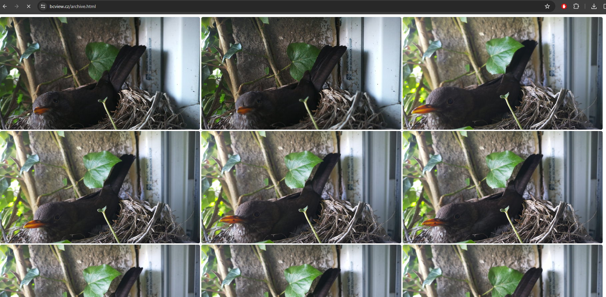

Documentation created as class assignment following rules of said assigment.

# Úvod
Pořizuje snímky PI kamerou. Přepíše aktuální obrázek a každých 20 minut obrázek archivuje. Umožňuje přístup pomocí jednoduchého webového GUI. (Zamýšleno pro hostování jako statický web například na AWS S3)

# Instalace
1. Raspberry PI s připojenou PI kamerou. PI kamerový modul 3 je preferován kvůli funkcím dynamického ostření.
2. Stáhnout repozitář se základními složkami a skriptem.
`git clone https://github.com/BitterMug/birdbox.git`
3. Nainstalujte balíček "ImageMagick" pro nástroj "convert".
`sudo apt-get install imagemagick`
4. <b>Volitelné:</b>
Nainstalujte webový server pro přístup přes prohlížeč a přidejte web s kořenovou složkou v kořenovém adresáři tohoto repozitáře. (nginx, Apache, ...)

# Jak používat
Pro otestování funkčnosti můžete spustit script "trigger.sh" `bash trigger.sh`.
Ve složce ./img se vytvoří soubor "bird-current.png" (Pozor na práva uživatele pro zápis do adresáře.)

Pro automatizaci lze využít Cron. Pomocí `crontab -e` přidáme úlohu `* * * * * bash <PATH_TO_FOLDER>/trigger.sh`

Pokud jste využili zmíněného webserveru je dostupné i jednoduché webové rozhraní. Pod tlačítkem <b>"ARCHIVE"</b> se nachází všechny archivované snímky. Demo je přístupné k nahlédnutí na www.bcview.cz.

# Licence
MIT License

Copyright (c) [2023] [Tomas Vesely]

Permission is hereby granted, free of charge, to any person obtaining a copy
of this software and associated documentation files (the "Software"), to deal
in the Software without restriction, including without limitation the rights
to use, copy, modify, merge, publish, distribute, sublicense, and/or sell
copies of the Software, and to permit persons to whom the Software is
furnished to do so, subject to the following conditions:

The above copyright notice and this permission notice shall be included in all
copies or substantial portions of the Software.

THE SOFTWARE IS PROVIDED "AS IS", WITHOUT WARRANTY OF ANY KIND, EXPRESS OR
IMPLIED, INCLUDING BUT NOT LIMITED TO THE WARRANTIES OF MERCHANTABILITY,
FITNESS FOR A PARTICULAR PURPOSE AND NONINFRINGEMENT. IN NO EVENT SHALL THE
AUTHORS OR COPYRIGHT HOLDERS BE LIABLE FOR ANY CLAIM, DAMAGES OR OTHER
LIABILITY, WHETHER IN AN ACTION OF CONTRACT, TORT OR OTHERWISE, ARISING FROM,
OUT OF OR IN CONNECTION WITH THE SOFTWARE OR THE USE OR OTHER DEALINGS IN THE
SOFTWARE.
